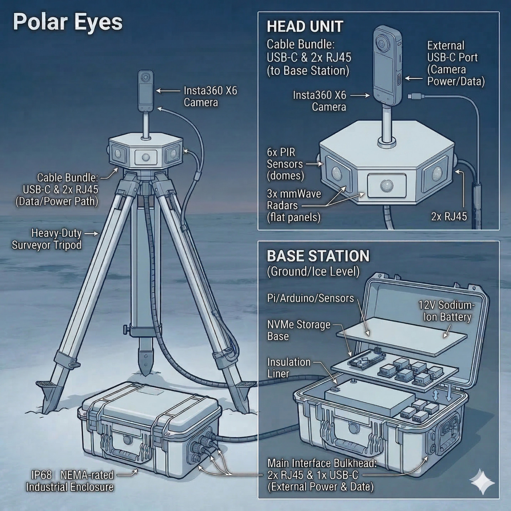
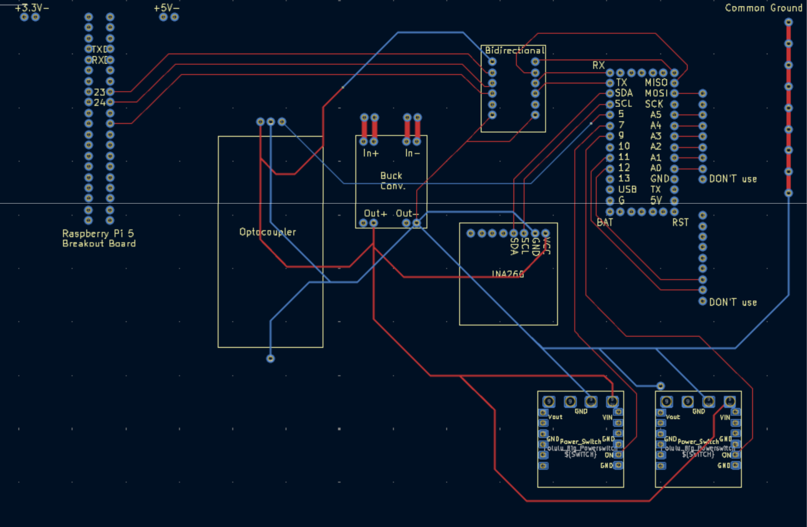
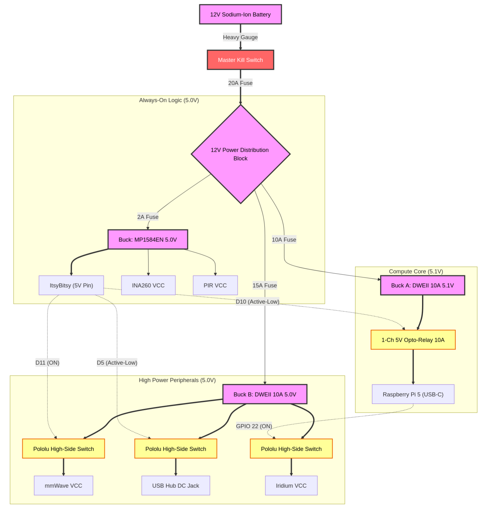

<p align="center">
  
</p>

# Polar Eyes

[](https://github.com/BU-EC463/EC463_Team_01_Polar_Eyes/actions/workflows/build-arduino.yml)
[](https://github.com/BU-EC463/EC463_Team_01_Polar_Eyes/actions/workflows/build-pi4.yml)

**Polar Eyes** is an autonomous, ultra-low-power 360° wildlife monitoring platform built for unattended sub-zero Arctic deployments. A single weatherized unit pairs an above-ice and below-ice Insta360 X5 camera with a multi-sensor trigger stack and a solar-buffered battery, designed to run **unattended for ≥ 90 days** between service visits.

The system is a **dual-node, asymmetric architecture** that decouples always-on sensing from on-demand compute — the only practical way to hit the energy budget while still capturing high-resolution imagery and video on a real wildlife event.

---

## Project Highlights

<p align="center">
  
  <br>
  <em>Field-ready prototype and integration team.</em>
</p>

<p align="center">
  
  <br>
  <em>Custom sentry PCB (final revision): ItsyBitsy carrier, PIR front-end, radar gating, and worker trigger outputs.</em>
</p>

---

## Architecture

```
   ┌──────────────────────────┐         ┌──────────────────────────┐
   │       SENTRY NODE        │  GPIO   │       WORKER NODE        │
   │   Adafruit ItsyBitsy     │ ──────► │     Raspberry Pi 5       │
   │  (always-on,  < 10 mW)   │ trigger │   (on-demand, ~3 W avg)  │
   ├──────────────────────────┤         ├──────────────────────────┤
   │ • 6× PIR motion sensors  │         │ • polar-listener.service │
   │ • 2× mmWave radar (gated)│         │ • Insta360 SDK / C++     │
   │ • Debounce + verify      │         │ • Photo / video capture  │
   │ • Pulses Pi shutter line │         │ • Telemetry CSV (GPS,    │
   │ • Periodic timelapse     │         │   baro, temp, batt)      │
   │   wake (90 s default)    │         │ • Auto-shutdown after    │
   │                          │         │   capture                │
   └──────────────────────────┘         └──────────────────────────┘
```

<p align="center">
  
  <br>
  <em>End-to-end data flow: sentry detection → worker capture → on-device storage.</em>
</p>

<p align="center">
  
  <br>
  <em>Sentry dual-stage state machine: PIR detection opens a radar verification window before triggering the worker.</em>
</p>

### Sentry Node — `sentry_itsybitsy/`

An Adafruit ItsyBitsy MCU that **never sleeps**. It draws under 10 mW while monitoring six analog PIR sensors and gating power to two mmWave radar modules. The radar window only opens after a PIR rising edge, which keeps the radar's ~80 mW load dark for the vast majority of operating time.

When the sentry confirms a detection (PIR + debounced radar), or when its periodic timelapse timer elapses, it pulses the worker's shutter line *and* the worker's safety-boot line in unison. A 45-second hardware debounce prevents trigger thrashing.

### Worker Node — `worker_pi_five/`

A Raspberry Pi 5 that is **off by default**. The sentry's pulse boots it (or wakes it from a held-low state); a Python systemd service (`polar-listener.service`) reads the GPIO trigger pins, dispatches photo or video capture through the Insta360 X5 camera over USB, and writes a row of telemetry (GPS, barometric pressure, temperature, battery) per capture. After the capture cycle completes the worker can be cleanly powered down by the sentry — minimizing duty-cycle and protecting the SD card.

A separate Pi 4 RAID-storage node (`storage_pi_four/`) is included in the repo for reference but **is not used in the current deployment**; the Pi 5 handles capture and storage directly.

---

## Energy Budget — the 90-day target

| Subsystem        | Idle Draw | Active Draw | Duty Cycle | Avg Contribution |
|------------------|-----------|-------------|-----------:|-----------------:|
| Sentry (always-on) | <10 mW  | <10 mW      | 100%       | ~10 mW          |
| Sentry radar (gated)| —      | ~80 mW      | <2%        | ~1.5 mW         |
| Worker (Pi 5)    | 0 mW (off)| ~3 W       | <2%        | ~60 mW          |
| Camera (Insta360)| 0 mW (off)| ~5 W       | event-driven | ~50 mW        |

A 90-day deployment with a 100 Wh battery + small solar trickle is the design point. The asymmetric sentry/worker split is what makes that arithmetic close.

<p align="center">
  
  <br>
  <em>Power architecture used to keep always-on draw low while allowing high-power capture bursts.</em>
</p>

---

## Repository Layout

```text
.
├── sentry_itsybitsy/         Sentry firmware (Arduino .ino + Makefile)
├── worker_pi_five/           Pi 5 worker — listener, scripts, camera SDK app
│   ├── src/                    Python: polar_listener, sensor_logger, timelapses
│   ├── scripts/                Bash wrappers around the camera_control binary
│   ├── camera_sdk/             C++ Insta360 control app + Insta360 SDK
│   ├── config/                 systemd unit (polar-listener.service)
│   └── setup_pi_five.sh        On-Pi deployment installer
├── samples/                  Telemetry and media artifacts
├── hardware/                 PCB/CAD/BOM assets and exports
├── storage_pi_four/          Pi 4 RAID node tooling and build scripts
├── docs/                     Project + module documentation
├── images/                   Diagrams + team photos
└── .github/workflows/        CI: Arduino firmware + Pi 4 image
```

---

## Quick Start

For end-to-end installation on a fresh Pi 5, see **[`docs/INSTALL.md`](docs/INSTALL.md)**.

In short:

```bash
git clone https://github.com/BU-EC463/EC463_Team_01_Polar_Eyes.git
cd EC463_Team_01_Polar_Eyes
sudo ./worker_pi_five/setup_pi_five.sh
sudo systemctl start polar-listener.service
journalctl -u polar-listener.service -f
```

For sentry firmware:

```bash
cd sentry_itsybitsy
make compile          # or: make upload PORT=/dev/ttyUSB0
```

---

## Documentation

- **[Installation Guide](docs/INSTALL.md)** — clone → deploy → run
- **[Architecture Deep Dive](docs/architecture.md)** — state machines, interfaces, and event flow
- **[Insta360 Control](docs/insta360_control.md)** — C++ camera_control reference
- **[Insta360 Quick Start](docs/insta360_quickstart.md)** — usage cheatsheet
- **[Pi 4 RAID Notes](storage_pi_four/README.md)** — reference (not in active deployment)
- **[BU Senior Design Poster (PDF, 40×30 in)](docs/Polar%20Eyes%20BU%20Poster%2040x30.pdf)** — final project poster

## Team

<p align="center">
  
</p>

<div align="center">

| James Conlon | Jackson Clary | Aidan Born | Hieu Nguyen | Zixian Wang |
|:---:|:---:|:---:|:---:|:---:|

</div>

- [Team Google Drive](https://drive.google.com/drive/folders/1AwAs2-8CEy-OaSo67aLub-TKVIZZDuBV?usp=drive_link)
- [ECE Senior Design Piazza](https://piazza.com/bu/fall2025/ec463/home)
- [Blackboard](http://learn.bu.edu/)

---

*EC463/EC464 Senior Design — Boston University, Team 01, 2025-26*
