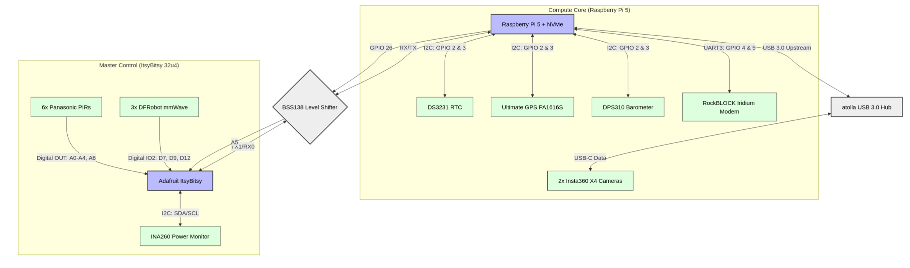
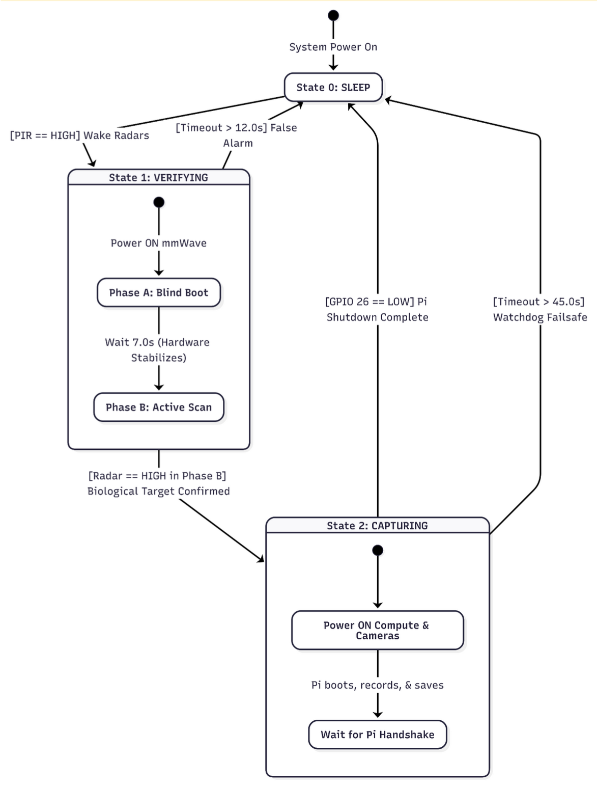
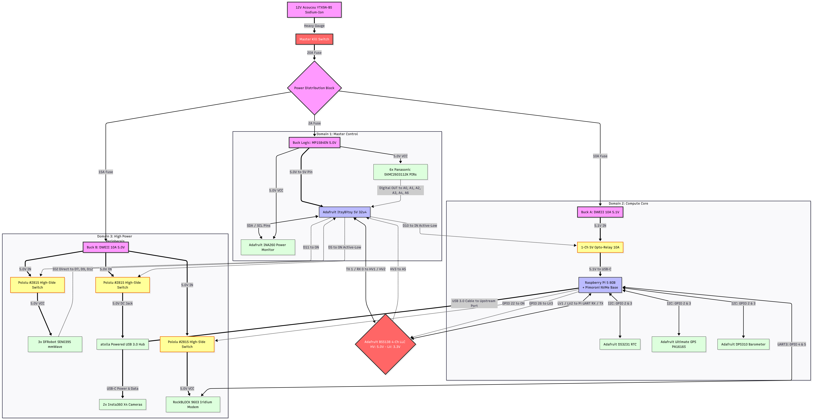

# Polar Eyes Architecture Deep Dive

This document captures the concrete runtime architecture, trigger flow, and module boundaries of the current `sentry_itsybitsy` + `worker_pi_five` deployment.

## System Overview

Polar Eyes uses a dual-node architecture:

- **Sentry node (`sentry_itsybitsy/`)**: always-on microcontroller, low power, trigger arbitration.
- **Worker node (`worker_pi_five/`)**: on-demand Pi 5 + Insta360 capture stack.

The sentry performs local filtering (PIR first, radar confirm), then issues a dual GPIO pulse to wake/trigger the worker.

## Visuals

### Data/Control Architecture

  

### Sentry Dual-Stage State Machine

  

### High-Level Block Diagram

  

## Trigger Pipeline (Runtime)

1. **PIR threshold crossing** on sentry opens a bounded mmWave verification window.
2. **mmWave debounce pass** confirms real movement.
3. Sentry emits **dual pulse**:
   - shutter line
   - worker boot/safety line
4. Worker service (`polar-listener.service`) reads GPIO state via `gpio_reader.sh`.
5. Worker dispatches either:
   - photo capture (`photo.sh`)
   - video start/stop (`recordStart.sh` / `recordStop.sh`)
6. Worker appends telemetry row to CSV after capture.

## Sentry Firmware Notes

Implementation source: `sentry_itsybitsy/sentry_itsybitsy.ino`

- PIR gating and radar debounce logic are implemented in the main loop.
- Trigger debounce lockout is controlled by `piTriggerDebounceMs`.
- Timelapse wake interval is controlled by `photoIntervalMs`.
- Trigger mode state is tracked with:
  - `PI_MODE_NONE`
  - `PI_MODE_VIDEO`
  - `PI_MODE_PHOTO`

## Worker Listener Notes

Implementation source: `worker_pi_five/src/polar_listener.py`

- Service runs as root to access GPIO and pinctrl utilities.
- Script wrappers are expected at absolute deployment paths under `/home/polareyes/...`.
- Capture outputs and telemetry are written under:
  - `/home/polareyes/insta360_control/storage/photos`
  - `/home/polareyes/insta360_control/storage/videos`
  - `/home/polareyes/insta360_control/storage/telemetry.csv`

## Interface Contract (Sentry -> Worker)

- **BCM 24**: photo trigger (high edge semantics)
- **BCM 27**: video gate (high=start, low=stop)
- Worker polling loop interprets these pin states continuously.

## Known Constraints

- Insta360 SDK binaries are not committed; deploy script expects them locally.
- Worker scripts currently depend on absolute file paths for offline predictability.
- Pi 4 RAID pipeline (`storage_pi_four/`) remains in repo for reference and CI image generation, but is not in the active Pi 5 runtime path.
